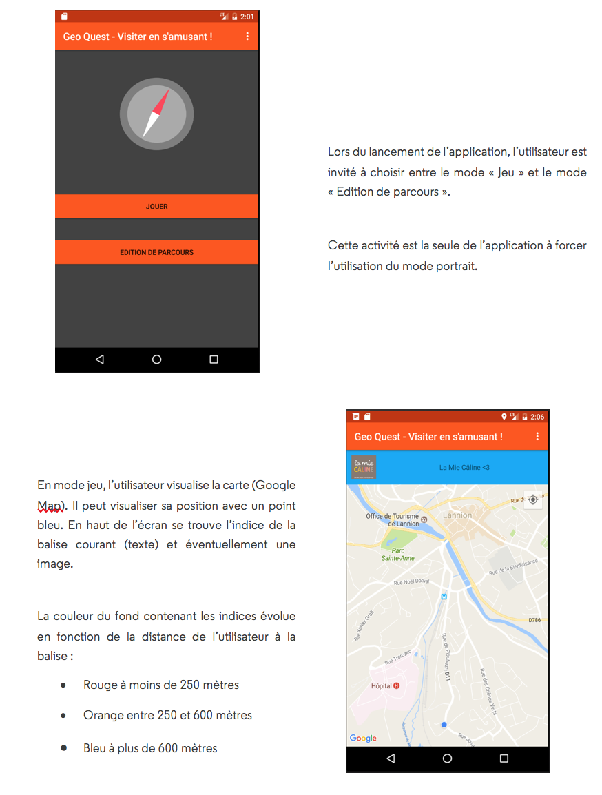
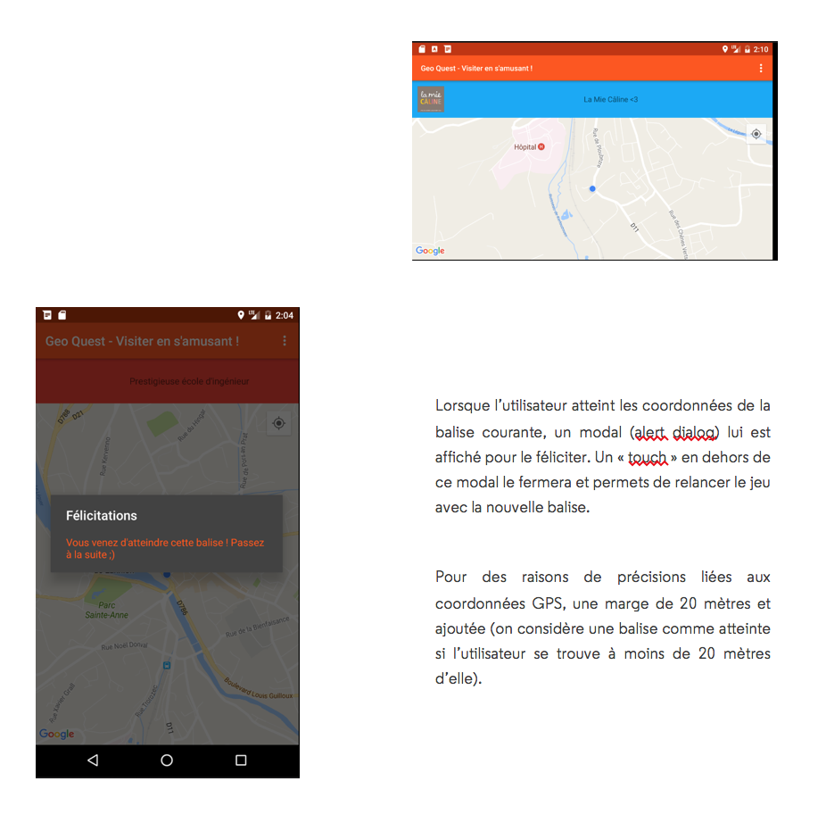
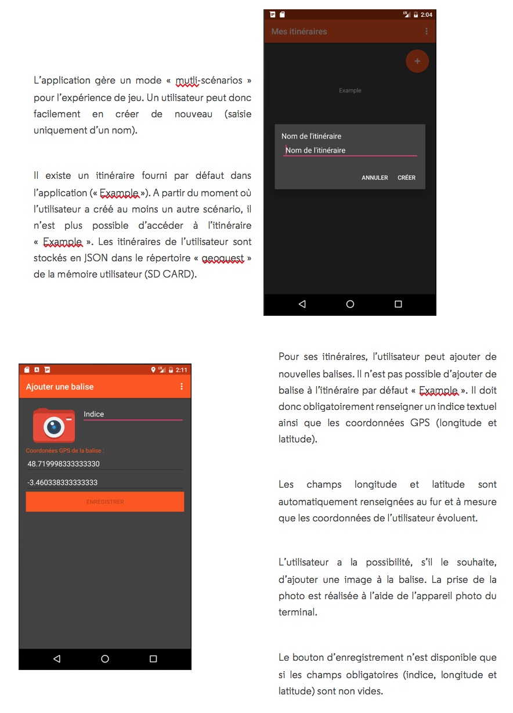
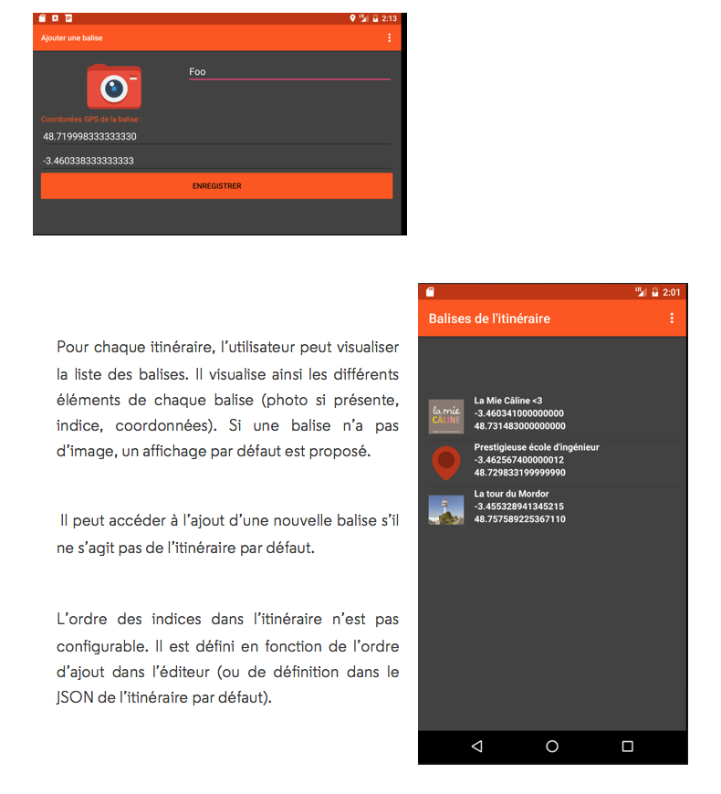

# Android - GeoQuest

Application Android réalisé dans le cadre de la formation IMR de l'ENSSAT.

## Objectifs
L’objectif de ce projet est de développer un jeu de piste pour Android. L’application consistera en une interface graphique qui accompagne l’utilisateur durant sa recherche d’indices (sous la forme de message et/ou de photos) qui lui permettent d’avancer progressivement sur un itinéraire balisé par des coordonnées GPS vers une destination finale. L’utilisateur pourra également créer de nouveaux itinéraires et y ajouter des balises. Les données devront être persistantes d’une exécution à l’autre de l’application.

## Résultats

